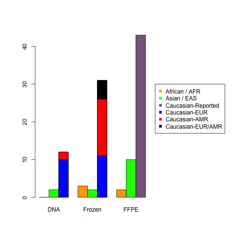

P-values for ancestry (**EUR vs AMR**) analysis were calculated using the following strategies:

**1)** ***Fisher’s exact test*** (using tentative **genotype** assignments, for 20% read fractions), using the `fisher.test()` R-base function.

**2a)** ***limma-voom*** ([Law et al. 2014](https://genomebiology.biomedcentral.com/articles/10.1186/gb-2014-15-2-r29)) on **read counts** with 1-variable (the ancestry assignment) 

**2b)** ***limma-voom*** ([Law et al. 2014](https://genomebiology.biomedcentral.com/articles/10.1186/gb-2014-15-2-r29)) on **read counts** with 2-variables (*adjusting for sample type*, along with predicted ancestry).

Ancestry predictions required the QC Array, which was only available for archived DNA and frozen tissue samples (so, only those two types could be combined).

Considering only QC Array samples with a single super-population assignment, there were 3 AMR and 16 EUR (European) archived DNA samples, compared to 20 AMR and 11 EUR frozen tissue samples. Thus, there were significantly more frozen samples from predicted AMR individuals than from predicted EUR individuals (Fisher’s Exact Test p-value = 0.0011, Figure 3). With this limited number of samples, we did not detect any differences between HPV genotypes for AMR and EUR individuals with a Fisher’s exact test p-value < 0.05.

The above plot shows frequencies of reported race per sample type, with supervised ADMIXTURE predictions (AMR/EUR) for “White/Caucasian” individuals. ADMIXTURE assignments always matched reported race, but if there was no reported race and no QC Array data for a particular sample (or if the reported race was “Other”), those samples were not included in this plot.  As you can see, no FFPE samples weer processed with the QC Array.

There are additional benchmarks (and method details) for the ancestry prediction process on [this page](https://github.com/cwarden45/QCarray_SuperPop/tree/master/1000_Genomes_Benchmarks), within the code to make the super-population assignments.
