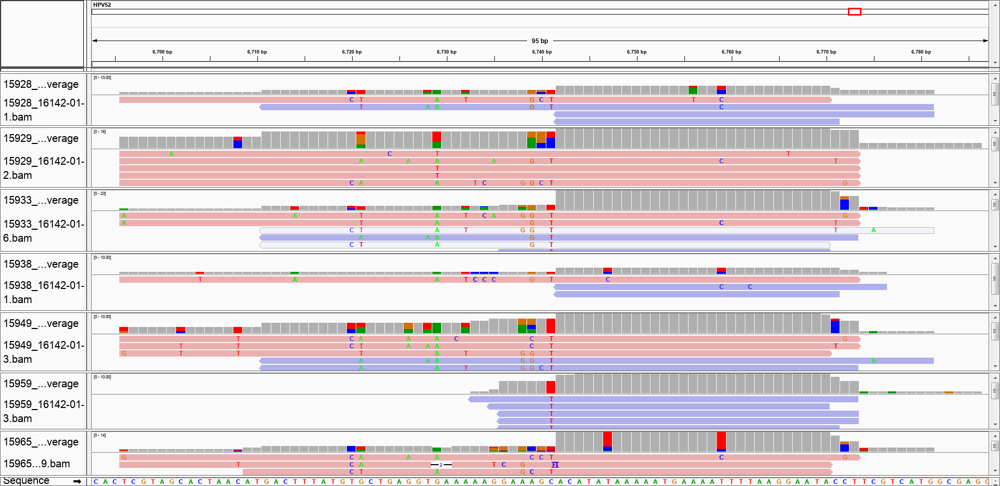
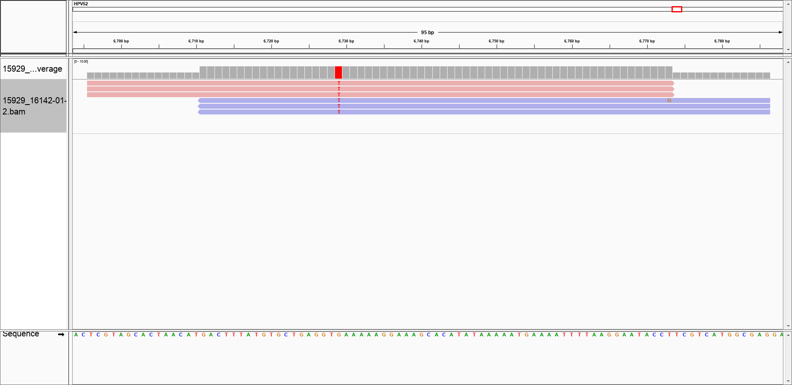

## Effect of Bowtie1 Alignment

It should be noted that some HPV genotypes may not be well amplified with this primer set.

For example, HPV52 has 5 mutations from the forward primer and 3 mutations from the reverse primer.

A small faction of reads can be aligned to the HPV52 genome reference.  The BWA-MEM alignment is shown below:


If Bowtie1 is used instead of BWA-MEM, then the HPV52 false positives art lower:


However, we believe that we **underestimate** the percent of *human off-target reads* if we use Bowtie1 instead of BWA-MEM.

I should also acknowledge that I learned about this from an anonymous reviewer, citing the [Matsukura and Sugase 2004](https://pubmed.ncbi.nlm.nih.gov/15207629/) publication.

The Bowtie1 alignment were run outside of the Docker image for this project.  However, Bowtie version 1.2.2 was used with the following command:

```
bowtie --best -p $THREADS -S $REF -1 $R1cutadapt -2 $R2cutadapt $SAMout
```

## Custom Representative Sequence Analysis for HPV52

In the process of putting together the code, we noticed that using the trimmed reads before the PEAR merging was important to get sequences that were more likely to truely come from HPV52.

However, we don't recommending using the representative sequences from the untrimmed reads, so those are not provided in this location.

If you use a similar genotyping process as described in the rest of the paper, there are no HPV52+ samples.

If you look for any non-zero **Bowtie1** read counts from **Bowtie1-PE_HPVtype_counts_final_names.txt**, the only sample with HPV52 reads is **S16142.01.12** (with 3 read counts).

However, if you go back to the main **PE_HPVtype_counts_final_names.txt** file used for then publication (with the BWA-MEM alignments), then we can use `extract_HPV_type_reads-HPV52-PEAR.py` to check PEAR-merged reads for the following samples:

**S16142.01.12**: 6 BWA-MEM *Paired-End* samtools idxstats Adjusted Read Counts

*S16142.01.49*: 6 BWA-MEM *Paired-End* samtools idxstats Adjusted Read Counts

*S16142.01.16*: 4 BWA-MEM *Paired-End* samtools idxstats Adjusted Read Counts

*S16142.01.33*: 2 BWA-MEM *Paired-End* samtools idxstats Adjusted Read Counts

*S16142.01.43*: 2 BWA-MEM *Paired-End* samtools idxstats Adjusted Read Counts

*S16142.01.11*: 1 BWA-MEM *Paired-End* samtools idxstats Adjusted Read Counts

*S16142.01.21*: 1 BWA-MEM *Paired-End* samtools idxstats Adjusted Read Counts

Among the PEAR merged alignments, can define representative HPV52 sequences among the folowing:

 - **S16142.01.12**
 - *S16142.01.33*
 - *S16142.01.21*

You can see a Clustal Omega alignment with the representative sequence and L1 Amplicon Expected reference (along with the primer mismatch locations) below:


