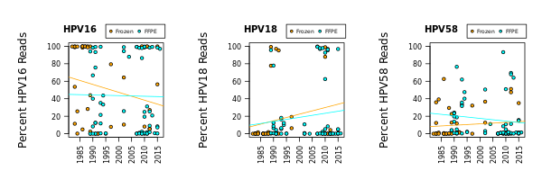

Tests for collection date were similar to [sample type](https://github.com/cwarden45/HPV_type_paper-archived_samples/blob/master/Downstream_R_Code/Extra_Analysis/Sample_Type_Full_Statistical_Analysis/README.md), except **the year 2000** was used as the threshold for 2-group analysis (instead of sample type).

Also, to further confirm a less significant result, Kolmogorov-Smirnov test (`ks.test()` function in R) was used to compare age or collection date distributions between positive and negative samples (for each HPV type). Otherwise, age and collection date are continuous variables and treated as such (instead of always having a 2-group comparison). Multi-variate models were also different (such as adjusting for sample type, instead of the percent human reads), and only linear read fractions (not log2 values) were used for linear regression analysis. However, the percent human reads was also either used as a 3rd variable in the model, or considered indirectly in the genotyping assignments. Comparisons were also performed separately for each possible sample type (in addition to including a 2nd variable for sample type in combined analysis).

Age and collection date were only available for frozen tissue and FFPE tissue samples (so, only those two types could be combined).

