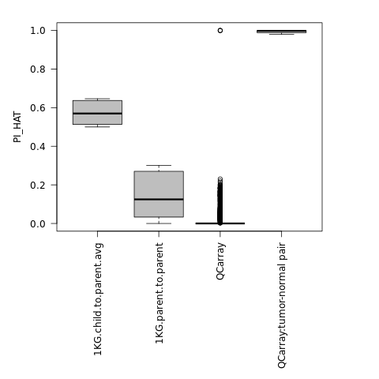

All known samples from the same patient were confirmed using the plink IBD calculations.

However, we also found some additional samples from the same patient.

For example, "*partialQCarray.pair1*" in Supplemental Table S1 refers to a mix of provided and QC Array defined pairings of samples:

 - Frozen tissue sample *S51458.T* and FFPE sample *S16142.01.12* were paired from the provided records
 - Frozen tissue sample *S51458.T* and Archived DNA sample *E373.65* were paired from the QC array
 - There were no FFPE QC Array samples, but this allows us to dtermine that FFPE sample *S16142.01.12* and Archived DNA sample *E373.65* are for the same patient
 
 Similarly, the QC Array determined that *E337.2* and *S51436.T* come from the same patient, as well as showing that *E337.03* and *S51441.T* come from the same patient.
 
 This information is not contradictory to the records, but they help complete the records.