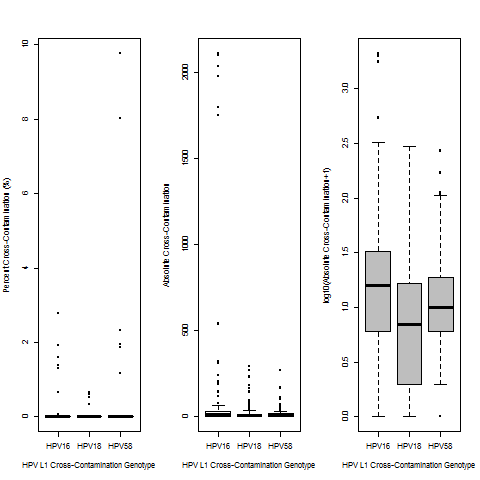

De-Multiplexing Considerations for Our L1 Amplicon-Seq Samples
-----------------
Although we expect that a small fraction of samples were affected, we observed that both technical and human error that could influence our results

One example of human error would be a sample that we withdrew from our Sequence Read Archive (SRA) deposit because a sample from another laboratory accidentally had the barcode intended for an HPV L1 amplicon sequencing sample.  In other words, by taking the time to look at our data more carefully, we could determine one of our samples (with considerably more reads than we should have expected) was mostly not an L1 Amplicon Sequencing sample.  It is not uncommon to need to change barcode sequences for each run, particuarly if a lot of samples are processed.

As described below, we also observed some evidence of cross contamination in samples from other laboratories that were processed with ours.  In most situations, we believe this is likely the result of “index hopping” ([Illumina Index Hopping Link](https://www.illumina.com/science/education/minimizing-index-hopping.html); [Costello et al. 2018](https://bmcgenomics.biomedcentral.com/articles/10.1186/s12864-018-4703-0); [Kircher et al. 2011](https://www.ncbi.nlm.nih.gov/pubmed/22021376)).  This may be harder to estimate (and possibly be more frequent) between L1 Amplicon Sequencing samples.  However, this exact sequence should be rare in samples that aren't supposed to have any HPV L1 Amplicons.

Cross-Contamination of Our L1 Amplicon-Seq Sequences into Other Lab's Samples
-----------------

The archived DNA and frozen tissues were from 2016 runs.  Since we could not recover those run folders, we could not do a similar comparison for those runs.

Nevertheless, the exact HPV L1 amplicon sequence also provides a measure of cross-contamination into other samples, which we can see in samples for other laboratories that shared a lane with samples from this project. We observed that one sample from another laboratory, which was not expected to have any L1 amplicon sequencing reads but shared a lane with samples from this project, had high HPV58 percentages (~10%) in each of the 2 lanes used for sequencing. This sample was processed in a run with 26 FFPE L1 amplicon sequencing samples (Run 271, with barcode GACCGG).  We believe this sample also had the wrong barcode (or otherwise had a QC issue, with few fragments to be sequenced), which would mean that it was incorrectly de-multiplexed.  This resulted in substantially fewer reads (<2000 total) compared to the L1 amplicon sequencing samples (311,370–3,757,409) and most other samples from the other laboratory (5–10 million).

This may be important if samples with fewer starting reads (such as the HPV L1 amplicon sequencing samples) may greater cross-contamination from de-multiplexing issues than most other samples processed on our HiSeq2500 machines (unless de-multiplexing is skipped or reduced altogether). While ~10% HPV58 sample from another lab was not supposed to have any L1 Amplicon-Sequencing reads (and therefore would have been called HPV-, if that was a human sample), this is important because this is the read fraction range (5–50%) in which we see HPV58 co-infections at a higher rate than previously reported. So, this specifically shows that we have observed HPV58 co-infections as false positives in the exact same run as some of our FFPE L1 Amplicon Sequencing samples (with the increased HPV58 co-infection rate), but typical index hopping likely has a greater effect on HPV58 co-infections with read fractions less than 15%. We would usually expect it to be lower (less than 5%, [Kircher et al. 2011](https://www.ncbi.nlm.nih.gov/pubmed/22021376)), although perhaps including samples from other labs didn’t entirely make up for having a low percent PhiX spike-in (<2%, [Illumina PhiX Link](https://support.illumina.com/bulletins/2017/02/how-much-phix-spike-in-is-recommended-when-sequencing-low-divers.html)) for a low-complexity library and/or there are special complications when sequencing HPV L1 Amplicons.
