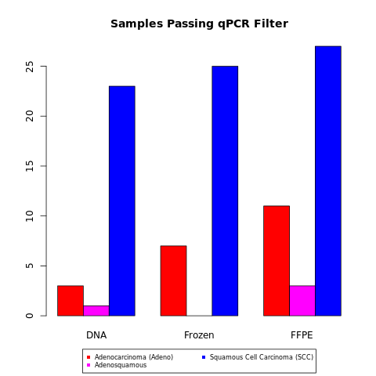
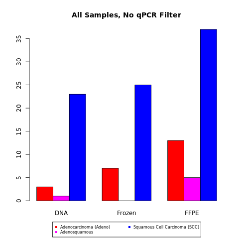
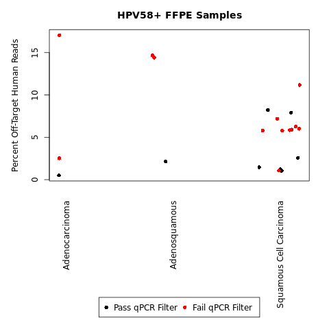

P-values for histological subtype (**SCC vs Adeno Types**) analysis were calculated using the following strategies:

For analysis, **"Adeno Types"** represents both "*Adenocarcinoma*" as well as "*Adenosquamous*".

The following comparisons were run on the samples with **>20% read fractions and qPCR filter** as well as **>5% read fractions (and no qPCR filter)**:

**1)** ***Fisher’s exact test*** (using tentative **genotype** assignments, for 20% read fractions) for **separate archive types**, using the `fisher.test()` R-base function.

**2a)** ***limma-voom*** ([Law et al. 2014](https://genomebiology.biomedcentral.com/articles/10.1186/gb-2014-15-2-r29)) for **separate archive types** on **read counts** with 1-variable (the ancestry assignment) 

**2b)** ***limma-voom*** ([Law et al. 2014](https://genomebiology.biomedcentral.com/articles/10.1186/gb-2014-15-2-r29)) for **overall samples** on **read counts** with 2-variables (*adjusting for archive type*, along with histological subtype).

**3a)** binomial GLM for logistic regression for **separate archive types** on **read counts** with 1-variable (the ancestry assignment), using the `glm()` R-base function with the parameter `family="binomial"`.

**3b)** binomial GLM for logistic regression for **overall samples** on **read counts** with 2-variables (*adjusting for archive type*, along with histological subtype), using the `glm()` R-base function with the parameter `family="binomial"`.

Here is a barplot of the samples with **20%** HPV genotype assignments (**with** the qPCR filter), for the 3 most common histological subtypes:

Here is a barplot of the samples with **5%** HPV genotype assignments (***without*** the qPCR filter), for the 3 most common histological subtypes:

Among the FFPE HPV58+ samples, you can see the percent off-target human reads per sample below (when separated by histological subtype):

Points are colored based upon whether they are also kep in the 20% assignments (with the qPCR filter).

The ANOVA p-value for percent off-target human reads varying as a function of histological subtype is 0.23 (among the above set of HPV58+ FFPE samples).