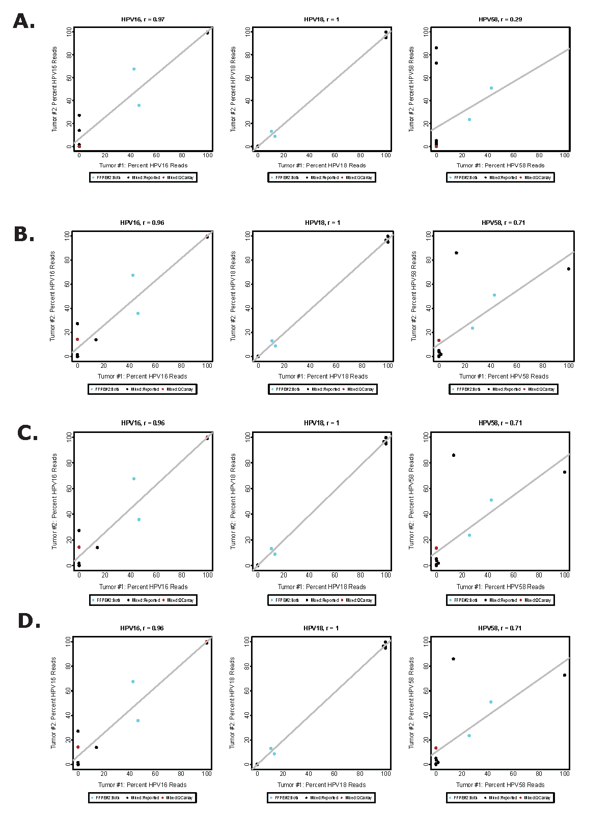

Pearson Correlation Coefficients for Tumor-Tumor Pairs
-----------------

<table>
  <tbody>
    <tr>
	<th align="center">HPV Genotype</th>
	<th align="center" colspan="4">Parameters for Assigning HPV Genotypes</th>
    </tr>
    <tr>
	<td align="center">Overall HPV Threshold</td>
	<td align="center"><b>&gt1.5x Human</b></td>
	<td align="center"><b>&gt1.2x Human</b></td>
	<td align="center"><b>&gt1.0x Human</b></td>
	<td align="center"><b>&gt0.8x Human</b></td>
    </tr>
    <tr>
	<td align="center">HPV Genotype Threshold</td>
  	<td align="center"><b>&gt1.2x Human</b></td>
	<td align="center"><b>&gt1.0x Human</b></td>
	<td align="center"><b>&gt0.8x Human</b></td>
	<td align="center"><b>&gt0.6x Human</b></td>
    </tr>
    <tr>
	<td align="center">HPV16</td>
  	<td align="center">r = 0.96</td>
	<td align="center">r = 0.97</td>
	<td align="center">r = 0.97</td>
	<td align="center">r = 0.97</td>
    </tr>
    <tr>
	<td align="center">HPV18</td>
  	<td align="center">r = 1.00</td>
	<td align="center">r = 1.00</td>
	<td align="center">r = 1.00</td>
	<td align="center">r = 1.00</td>
    </tr>
    <tr>
	<td align="center">HPV58</td>
	    <td align="center"><b><i>r = 0.29</i></b></td>
	<td align="center">r = 0.71</td>
	<td align="center">r = 0.71</td>
	<td align="center">r = 0.71</td>
    </tr>
</tbody>
</table>

Tumor-tumor pairs: FFPE-FFPE; FFPE-frozen; Mixed: QC Array (DNA-frozen).

Notice the considerably lower HPV58 correlation coefficient with the most conservative criteria.

HPV58 in Tumor-Normal Pairs
-----------------

<table>
  <tbody>
    <tr>
	<th align="center"></th>
	<th align="center" colspan="4">Parameters for Assigning HPV Genotypes</th>
    </tr>
    <tr>
	<td align="center">Overall HPV Threshold</td>
	<td align="center"><b>&gt1.5x Human</b></td>
	<td align="center"><b>&gt1.2x Human</b></td>
	<td align="center"><b>&gt1.0x Human</b></td>
	<td align="center"><b>&gt0.8x Human</b></td>
    </tr>
    <tr>
	<td align="center">HPV Genotype Threshold</td>
  	<td align="center"><b>&gt1.2x Human</b></td>
	<td align="center"><b>&gt1.0x Human</b></td>
	<td align="center"><b>&gt0.8x Human</b></td>
	<td align="center"><b>&gt0.6x Human</b></td>
    </tr>
    <tr>
	<td align="center">HPV58 in Tumor-Normal Pairs/td>
  	<td align="center">All HPV58 Tumor Frequencies Low</td>
	<td align="center">All HPV58 Tumor Frequencies Low</td>
	<td align="center">All HPV58 Tumor Frequencies Low</td>
	<td align="center"><b><i>HPV58 Tumor-Normal Divergence</i></b></td>
    </tr>
</tbody>
</table>

