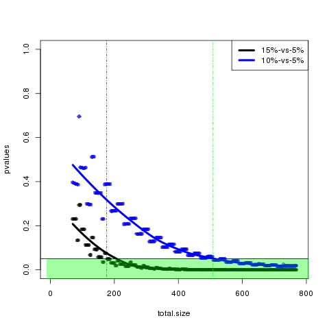

There were 28 archived DNA, 40 frozen tissue, and 43 FFPE ICC samples passing the qCPR filter that we propose (a subset of which would be HPV+ for the genotype analysis).

So, while it doesn't exactly match any of the numbers for the comparisons, p-values for a Fisher Exact test were tested for the following conditions:

**1)** 15% genotype (larger group) versus 5% genotype (smaller group), represented by a *black* line

**2)** 10% genotype (larger group) versus 5% genotype (smaller group), represented by a *blue* line

The sample size for the larger groups started at 40 samples and the sample size for the smaller group started at 30 samples.

Sample size was incremented by 1 sample per group.  This makes the group size more similar at larger numbers.  The decrements in samples size are not plotted, since the difference in group sizes would become greater (and the goal is to give some sense of how many combined samples would be needed to get an unadjusted p-value < 0.05).

This results in the following plot:

There other methods for p-value calculation that can be more sensitive, and multiple tests were compared in subfolders including but not limited to  [Sample_Type_Full_Statistical_Analysis](https://github.com/cwarden45/HPV_genotype_paper-archived_samples/tree/master/Downstream_R_Code/Extra_Analysis/Sample_Type_Full_Statistical_Analysis).  However, higher false positives (possibly from an underestimated false positive rate) may also be worth taking into consideration.  So, with the right parameters / filtering, we thought the Fisher's Exact test provided the best balance for our study (as far as we could tell).

The use of integers can cause the p-values to not strictly decrease, which is why a loess trendline was added.

The dashed lined represent the minimum sample size with a p-value > 0.05 (for individual lines, not the loess fit).
