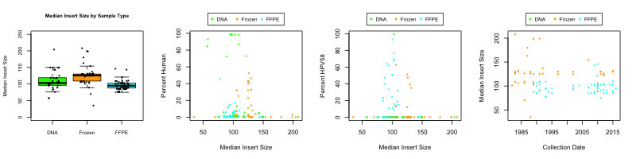

**Median insert size of off-target human reads from L1 amplicon sequencing varies between sample types.**

**(A)** Box-plots showing the distribution of median insert size for human-aligned reads (separated by sample type, ANOVA p-value = 9.4 x 10-8)

**(B)** Scatterplot of the percentage of human reads plotted against median insert sizeFrozen samples have off-target reads with a slightly larger insert size compared to those in archived DNA and frozen tissue samples.

**(C)** Scatterplot of the percentage of HPV58 reads plotted against median insert size.

**NOTE:** Samples are sequencing following gel extraction for an amplicon of the expected size.  So, this having reads similar to the expected size is not surprising (even if the distribution of reads would have been different if gel extraction had not been performed).
