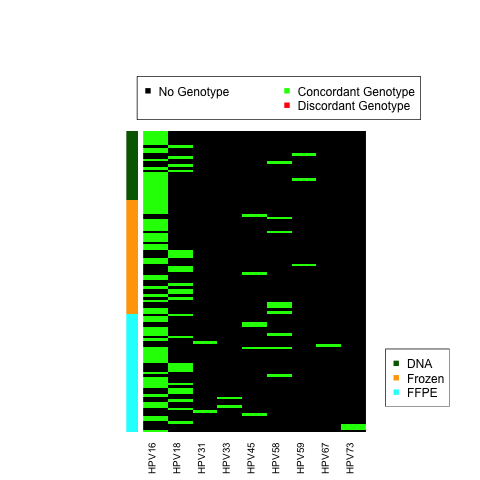
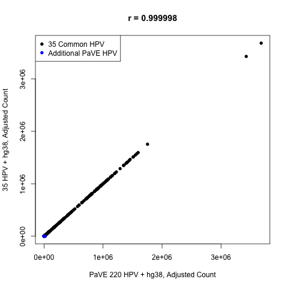

## Summary

For this study, we obtained the same genotypes and highly correlated read counts if we used our set of **35** HPV + hg38 human genome reference versus the PaVE **220** HPV + hg38 human genome reference.

For other papers, it might be helpful to start from the PaVE database, but the strategy that we describe could still be helpful in accessing if there was an important HPV type within a cohort that was missing from the PaVE database that explains a large fraction of the reads in at least 1 sample.

## Details

**1)** The [PaVE](https://pave.niaid.nih.gov/) database is for a variety of papliomavirsuses.

So, the first step was to search for *human* papliomavirsus (HPV) reference genomes.

After reformatting the sequence headers with the script `reformat_FASTA.pl`, this produces the file **PAVE_download_220224-reformat.fasta**.

**2)** These HPV sequences were then combined with the human genome reference and indexed using the following commands:

```
#!/bin/bash
HPVREF=../PaVE_download_220224-reformat.fasta
HG38REF=/path/to/hg38.fa
NEWREF=hg38_plus_PaVE220.fa

cat $HPVREF $HG38REF > $NEWREF
/opt/samtools-1.3/samtools faidx $NEWREF
/opt/bwa/bwa index -a bwtsw $NEWREF
```

**3)** Code similar to the 35 HPV + hg38 analysis can then be run (`BWA_MEM_alignment.py` followed by `call_genotype_mixed_ref.py`).

An example *parameters.txt* file is also provided.

The resulting **hg38_plus_PaVE_220HPV_genotype_calls.txt** file is uploaded in this folder.

**4)** Again, using code similar to the 35 HPV + hg38 analysis, adjusted read counts can be defined using `PE_HPVtype_counts-part1.R` followed by `PE_HPVtype_counts-part2.R`.

The resulting **PaVE_220HPV_PE_HPVtype_counts-final_names.txt** file is uploaded in this folder.

**5)** A heatmap showing the consistency of genotype assignments can be created using `compare_genotypes.R`.



**Please notice that *no* additonal HPV genotype assignments are made using the larger set of HPV reference genomes from the PaVE database, if considering only samples that pass the qPCR flag.**  This might be expected given the sample size of this cohort makes detection of very rare HPV types/genotypes less likely, along with these being tumor samples and low-risk HPV types are included within the PaVE database.

**6)** A scatterplot showing the adjusted counts assigned per HPV type per sample can be created using `compare_read_counts.R`.

If an HPV genome was not in the 35 HPV reference set used for this paper, then the adjusted counts were set to 0 in order to compare to the larger set of 220 HPV genomes.



**As you can see, the linear read counts are very well correlated with either reference set.**
