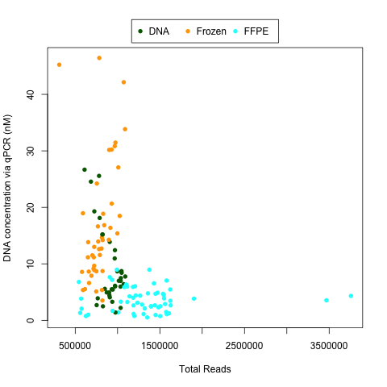

The number of reads per sample doesn't correspond to the amount of starting DNA.

The sample types are seqeunced in separate batches, and there is some difference in the FFPE samples in that respect.

However, you can see this is very different than the plots that consider the concentration versus the *percent human reads*.

In terms of addressing a question of whether more reads are generated with more starting material, you can clearly see a *lack* of a **positive** correlation.

The plot above was created using `create_plot.R`.
