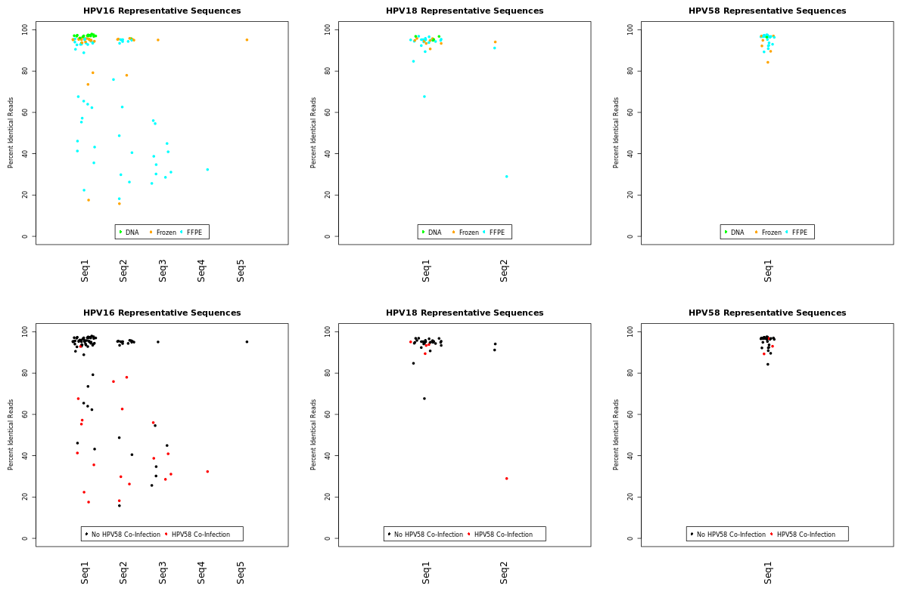

### Genomic BLAT Hits (for HPV L1 Amplicons, on hg38 human genome)

<table>
  <tbody>
    <tr>
    <tr>
	<th align="center"></th>
	<th align="center">L1 Amplicon Query Match</th>
	<th align="center">hg38 Hit Position Match</th>
	<th align="center">Percent Identity</th>
	<th align="center">hg38 RepeatMasker?</th>
    </tr>
    <tr>
	<td align="center"><b>HPV16</b> (94 bp, trimmed)</td>
  	<td align="center">50-72 (23 bp) 45-67 (23 bp) 51-70 (20 bp)</td>
	<td align="center">chr20:42618942-42618964:- (23 bp) chr18:45784565-45784587:+ (23 bp) chr1:196249786-196249805:-(20 bp)</td>
	<td align="center">100.0% 95.7% 100.0%</td>
	<td align="center">LINE <i>No</i> SINE / LINE</td>
    </tr>
    <tr>
	<td align="center"><b>HPV18</b> (98 bp, trimmed)</td>
  	<td align="center"><i>[no hits]</i></td>
	<td align="center"><i>[no hits]</i></td>
	<td align="center"><i>NA</i></td>
	<td align="center"><i>NA</i></td>
    </tr>
    </tr>
    <tr>
	<td align="center"><b>HPV58</b> (91 bp, trimmed)</td>
  	<td align="center">14-47 (33 bp) 36-63 (27 bp) 51-77 (27 bp) 45-78 (34 bp) 42-61 (20 bp) 51-70 (20 bp)</td>
	<td align="center">chr13:33648186-33648216:+ (31 bp) chr17:56955818 -56955847:- (30 bp) chr4:166595761-166595808:+ (48 bp) chr2:48225133-48225159:+ (27 bp) chr4:35515819-35515838:+ (20 bp) chr11:110764058-110764077:+ (20 bp)</td>
	<td align="center">80.7% 100.0% 100.0% 74.1% 100.0% 100.0%</td>
	<td align="center"><i>No</i> LINE LINE LINE <i>No</i> LINE</td>
    </tr>
</tbody>
</table>

The most frequent HPV L1 Amplicon Sequence (which also matches the genomic sequence for each genotype) was used for the BLAT query.

Primers (23 bp forward, 25 bp reverse) are removed prior to read merging and alignment (before defining consensus sequences).

NA means "Not Applicable"

### Frequencies of the representative sequences of common HPV L1 genotypes. (for 20% read fraction genotypes)

**NOTE:** These are assignments **before** filtering samples with the qPCR filter.  Most of those HPV58 co-infections (in FFPE samples) are removed using that filter (which is why this content was moved to the "Extra_Analysis" instead of a supplemental figure), even though the SNPs are in HPV16.

**(A)** Scatter plots showing the fraction of reads for each HPV genotype that exactly match the “representative sequences” for that genotype (Seq1–5), which comprised more than 15% of reads in at least one HPV+ sample. Each dot represents one sample, colored according to sample type. Some samples contained more than one representative sequence and thus are represented by multiple points.  In other words, there were 6 representative sequences for HPV16, 2 representative sequences for HPV18, and 1 representative sequence for HPV58.

**(B)** Same data as shown in *(A)*, but each sample is colored according whether or not it contains an HPV58 co-infection (in red), which was common for samples with HPV16 present at <80% frequency. 

