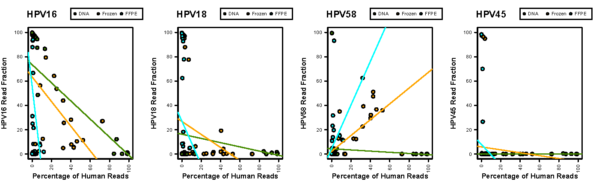

**A)** Plots / Statistics without qPCR Filter

<table>
  <tbody>
    <tr>
	<th align="center"></th>
	<th align="center">Archived DNA</th>
	<th align="center">Frozen Tissue</th>
	<th align="center">FFPE Tissue</th>
    </tr>
    <tr>
  	<td align="center">HPV16</td>
	<td align="center"><b>r = -0.64 lm p-value = 4.5 x 10-5</b></td>
	<td align="center"><b>r = -0.43 lm p-value = 0.0039</b></td>
	<td align="center"><b>r = -0.29 lm p-value = 0.026</b></td>
    </tr>
    <tr>
  	<td align="center">HPV18</td>
	<td align="center">r = -0.22 lm p-value = 0.21</td>
	<td align="center">r = -0.26 lm p-value = 0.086</td>
	<td align="center">r = -0.16 lm p-value = 0.23</td>
    </tr>
    <tr>
  	<td align="center">HPV58</td>
	<td align="center">r = -0.12 lm p-value = 0.52</td>
	<td align="center"><b>r = 0.71 lm p-value = 5.3 x 10-8</b></td>
	<td align="center"><b>r = 0.49 lm p-value = 0.00011</b></td>
    </tr>
    <tr>
  	<td align="center">HPV45</td>
	<td align="center">r = 0.18 lm p-value = 0.32</td>
	<td align="center">r = -0.11 lm p-value = 0.47</td>
	<td align="center">r = -0.11 lm p-value = 0.42</td>
    </tr>
</tbody>
</table>

**B)** Plots / Statistics *with* qPCR Filter

<table>
  <tbody>
    <tr>
	<th align="center"></th>
	<th align="center">Archived DNA</th>
	<th align="center">Frozen Tissue</th>
	<th align="center">FFPE Tissue</th>
    </tr>
    <tr>
  	<td align="center">HPV16</td>
	<td align="center"><b>r = -0.64 lm p-value = 4.4 x 10-5</b></td>
	<td align="center"><b>r = -0.43 lm p-value = 0.0039</b></td>
	<td align="center"><b>r = -0.35 lm p-value = 0.021</b></td>
    </tr>
    <tr>
  	<td align="center">HPV18</td>
	<td align="center">r = -0.22 lm p-value = 0.21</td>
	<td align="center">r = -0.26 lm p-value = 0.086</td>
	<td align="center">r = -0.11 lm p-value = 0.50</td>
    </tr>
    <tr>
  	<td align="center">HPV58</td>
	<td align="center">r = -0.12 lm p-value = 0.52</td>
	<td align="center"><b>r = 0.71 lm p-value = 5.3 x 10-8</b></td>
	<td align="center">r = 0.28 lm p-value = 0.07</td>
    </tr>
    <tr>
  	<td align="center">HPV45</td>
	<td align="center">r = 0.18 lm p-value = 0.32</td>
	<td align="center">r = -0.11 lm p-value = 0.47</td>
	<td align="center">r = -0.09 lm p-value = 0.58</td>
    </tr>
</tbody>
</table>

P-values are calculated using linear regression in R.

The qPCR filter removes the largest number of FFPE samples, so it makes sense that sample type would be the most affected with the re-calculation.  However, this leaves a noticable effect of human reads on HPV58 read fractions in frozen tissue samples.
